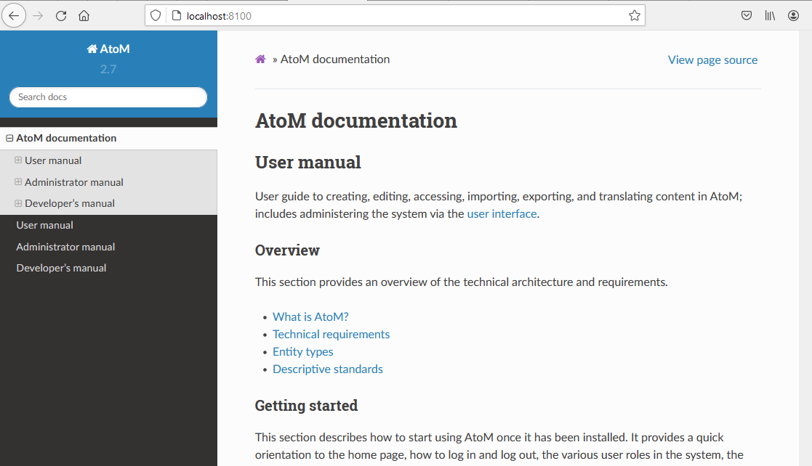

# atom-docs on Docker

This [Access to Memory](https://www.accesstomemory.org/) documentation can be
generated and viewed locally in a web browser with the provided Docker Compose
configuration. Viewing the documentation locally can be very helpful when
making updates to quickly check for syntax or content errors.

## Prerequisites

A working installation of the Docker Engine and Docker Compose is required.

See [Docker Engine Install](https://docs.docker.com/engine/install/) for
instructions on installing the Docker Engine on your Operating System.

Docker Compose is included with Docker Desktop on Windows and macOS.  For
Linux see the [Docker Compose Install](https://docs.docker.com/compose/install/)
instructions.

## Running atom-docs on Docker

1. In the atom-docs directory run `docker-compose up -d` to build and start
   the atom-docs Docker container
1. Once the container is built, open a web browser and navigate to
  `http://localhost:8100`

## Viewing updates

The Docker container uses
[Sphinx Autobuild](https://pypi.org/project/sphinx-autobuild/) to automatically
rebuild the HTML documents when any "rst" file is changed in the atom-docs
directory. After saving your changes the HTML documentation should automatically
update in your browser.

## When you are done

In the atom-docs directory run `docker-compose down` to stop and remove the
atom_docs container and network.
